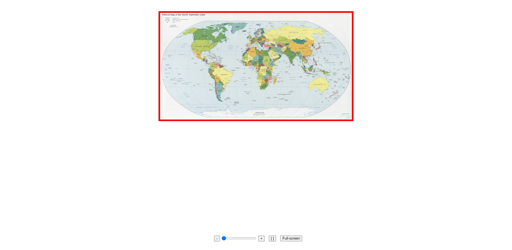

# zoom-for-find-on-image
An interface where allows user to add a marker on an image while zooming in/out.


## 📝 Installation

Install the project with npm :

```bash
  // Install all dependencies.
  npm install

  // Run the project.
  npm start
```

## 📚 Libraries used

| Library      | Version | Description                           |
|:-------------|:--------|:--------------------------------------|
| `react`      | ^18.2.0 | React core code.                       |
| `react-dom`  | ^18.2.0 | Package provides DOM-specific methods. |
| `@babel/core`| ^7.20.2 | Transpile ECMAScript 2015+ code into compatible version of JavaScript in current and older browsers or environments. |
| `parcel`       | ^1.12.5 | JavaScript compiler, CSS transformer, and source maps implementation.        |


## 🏠 Components list
Here is some information about components used:
| Component              | Description                                              | State | Props  |
|:-----------------------|:---------------------------------------------------------|:--------|:--------------------------------------|
| [App.jsx](./App.jsx)              | Contains all main page content.                          |n/a|n/a|
| [ImageComponent.jsx](./src/components/ImageComponent/ImageComponent.jsx)          | Contains the image and actions bar.   |{ marker: array, imgOffsets: array, imHeight: number, mobileMode: boolean }|n/a|


## 🚀 Features/Screenshots
Here is the rendering of the main page :


Through this main page, here are some functionalities :
- Mobile (Full-screen) mode : when clicking on "Full-screen" button, the background becomes black, zoom bar and buttons vanish  and with touch pad the user can zoom in/out while having the possibility to add the marker.

  


- Desktop mode :
  - Buttons "-" and "+" are available and will resize the image if the user click on it. The zoom bar is also usable to resize the image. The reset button will resize the image to its default value.
  

  - The user can add a marker on the map. Unfortunately, the marker doesn't keep its position when the image is resized (see the bugs/limitations section).
  


## ⛔ Bugs/limitations
Functional side :
  - The red border is displayed before loading the image.
  - The marker doesn't have an icon.
  - Mobile mode :
    - The library "is-mobile" is not used.
    - The marker size changes when zoom in/out.
  - Desktop  mode :
    - The marker doesn't keep its place when zoom in/out.
    - The image is out of the viewport and not accessible when zoom-in.
    - The actions bar shifts slightly at a certain point of zoom-in.

Code side :
- Further split the code into components (eg : actions bar, "Full-screen" button, etc.)
- Better manage the css (currently inserted in-line).
- Export utils functions in separate js file.

## ✨ Next steps
- Manage landscape mode on mobile devices.
- Resize the marker when zoom-in.


## 👨‍🚀 Author

   [@BHocine21](https://github.com/BHocine21)

[](https://www.linkedin.com/in/hocine-bouhlala-407025132/)

