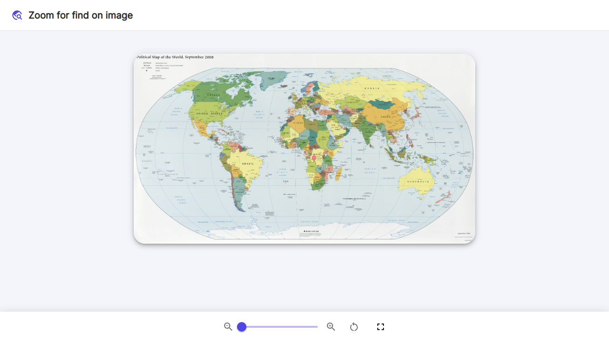
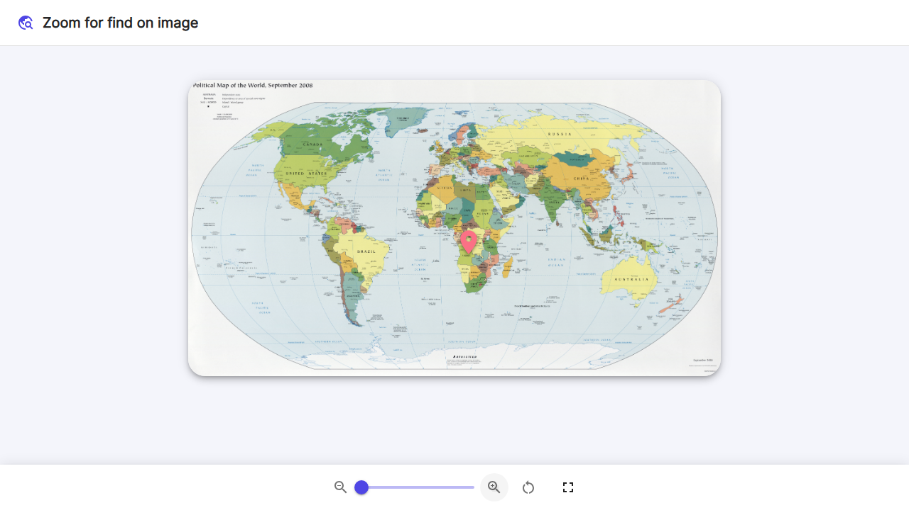
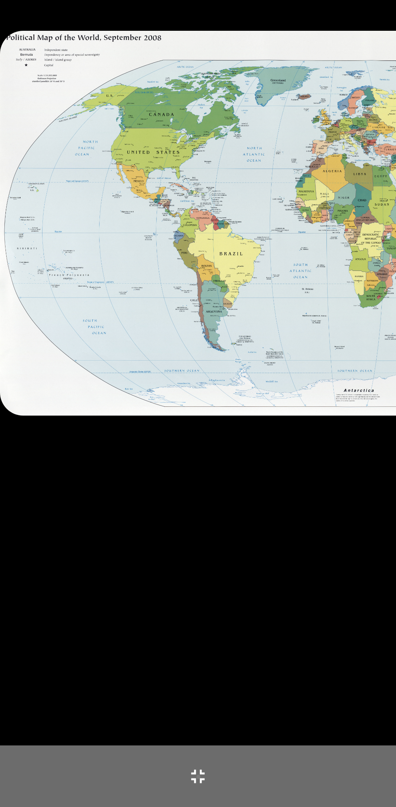

# 🔍 Zoom for find on image

Une interface qui permet de zoomer sur une image et d'y poser un marqueur précis — en desktop comme en plein écran mobile.


## ✨ Fonctionnalités

- **Zoom** via slider ou boutons `+`/`-`, avec réinitialisation en un clic.
- **Marqueur** posé d'un clic sur l'image, ancré en pourcentage de l'image donc toujours correctement positionné à n'importe quel niveau de zoom.
- **Plein écran** dédié, avec interface simplifiée.
- **Responsive** desktop / tablette / mobile, navigation clavier et `aria-label` sur tous les contrôles.

| Marqueur posé                                 | Zoom avant                              | Plein écran (mobile)                                       |
| --------------------------------------------- | --------------------------------------- | ---------------------------------------------------------- |
|  |  |  |

> Pour le détail de la stack technique et des choix d'architecture, voir [ARCHITECTURE.md](./ARCHITECTURE.md).

## 🚀 Installation

```bash
pnpm install
pnpm dev
```

## 📦 Scripts

| Commande                                               | Description                                    |
| ------------------------------------------------------ | ---------------------------------------------- |
| `pnpm dev`                                             | Serveur de développement Vite                  |
| `pnpm build`                                           | Vérification TypeScript + build de production  |
| `pnpm preview`                                         | Sert le build de production en local           |
| `pnpm lint` / `pnpm lint:fix`                          | ESLint                                         |
| `pnpm format` / `pnpm format:check`                    | Prettier                                       |
| `pnpm spell`                                           | cspell                                         |
| `pnpm test` / `pnpm test:watch` / `pnpm test:coverage` | Tests unitaires (Jest + React Testing Library) |
| `pnpm e2e` / `pnpm e2e:ui`                             | Tests end-to-end (Playwright)                  |

## ⛔ Limitations connues

- Une seule image statique : le marqueur n'a pas besoin de survivre à un changement d'image pour l'instant.
- Pas de layout dédié au mode paysage mobile : le plein écran s'adapte à l'orientation du device sans agencement spécifique.

## 👨‍🚀 Auteur

[@BHocine21](https://github.com/BHocine21)

[](https://www.linkedin.com/in/hocine-bouhlala-407025132/)
